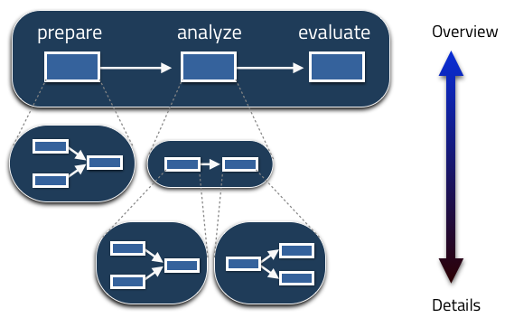

# How does Digdag work?

## Automating workflow with Digdag

A workflow automates any kinds of manual operations. You'll define a sequence of tasks as workflow, then Digdag runs it for you. Tasks are defined using operator plugins so that you can control various kinds of systems from the centralized workflow definition (see [operators.html](operators) section for the list of built-in operator plugins).

As a runtime framework of the plugins, Digdag takes care of complex problems around workload automation so that you can focus on automation. If a task fails, Digdag sends an alerts. If the workflow doesn't finish within expected amount of tiem, Digdag sends a notification. Digdag runs many tasks on distributed servers in parallel. Digdag starts workflow automatically based on scheduling options.

## Organizing tasks by groups

As you automate complex workflow, the definition becomes complicated quickly. Using Digdag, you can organize tasks into groups. When you review the definition, you will see from a bird's view, then dive in to details. It makes it easy to debug and review your workflow during development. In production environment, it helps administrators to know what's happening and how to fix problems.

Grouping tasks is used aslo for parameters. A parent task can export variables for children tasks (as like `export` command of shell scripts that sets environment variables). A parent can generate children tasks at run time so that you can run different tasks depending on the results of previous tasks.

See [workflow_definition.html#defining-variables](Defining variables) section for details.

## Workflow as code

Digdag workflow is defined as code. This brings best practice of software development: version management, code review, tests, and collaboration using pull-requests. You can push a workflow to a git repository, and anyone can pull it to reproduce the same results with you.

## Running with local mode

Digdag is a single-file executable command. Creating and running a new workflow is as easy as Makefile.

Files with ``*.dig`` suffix are used for workflow definitions. `digdag run my_workflow.dig` command runs the workflow.

See [Workflow definition](workflow_definition.html) section for the definition syntax.

